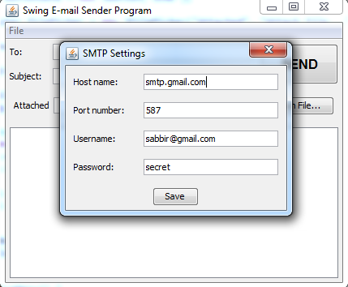

# Java-Swing-Email
Java Swing application that sends e-mail messages (with an optional attachment) from a SMTP account. The application would look like this:

The SMTP settings can be configured in a dialog which is accessible from menu File > Settings… as follows:

