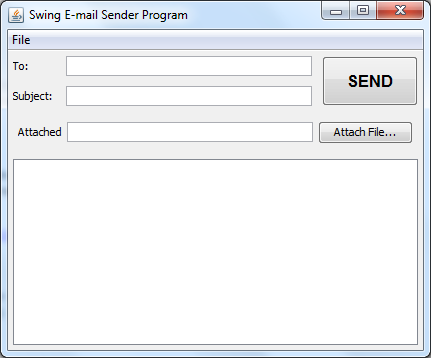
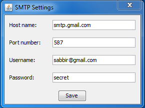
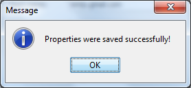
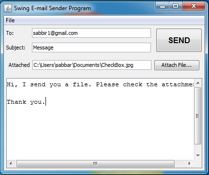
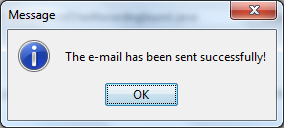

# Java-Swing-Email
Java Swing application that sends e-mail messages (with an optional attachment) from a SMTP account. The application would look like this:

### Testing the application
Launch the application by executing the class SwingEmailSender. First, we need to specify SMTP settings (if you have not created the smtp.properties file yet). Click File > Settings… to show up the SMTP Settings dialog as follows:

Enter your SMTP account information and click Save, a successful message dialog should appear:

Back to the e-mail form, enter the information as follows:

The attached file is optional, so we can pick one or not. When done, click SEND button to send the e-mail. If everything is going well, then we should get the following message after a few seconds:

